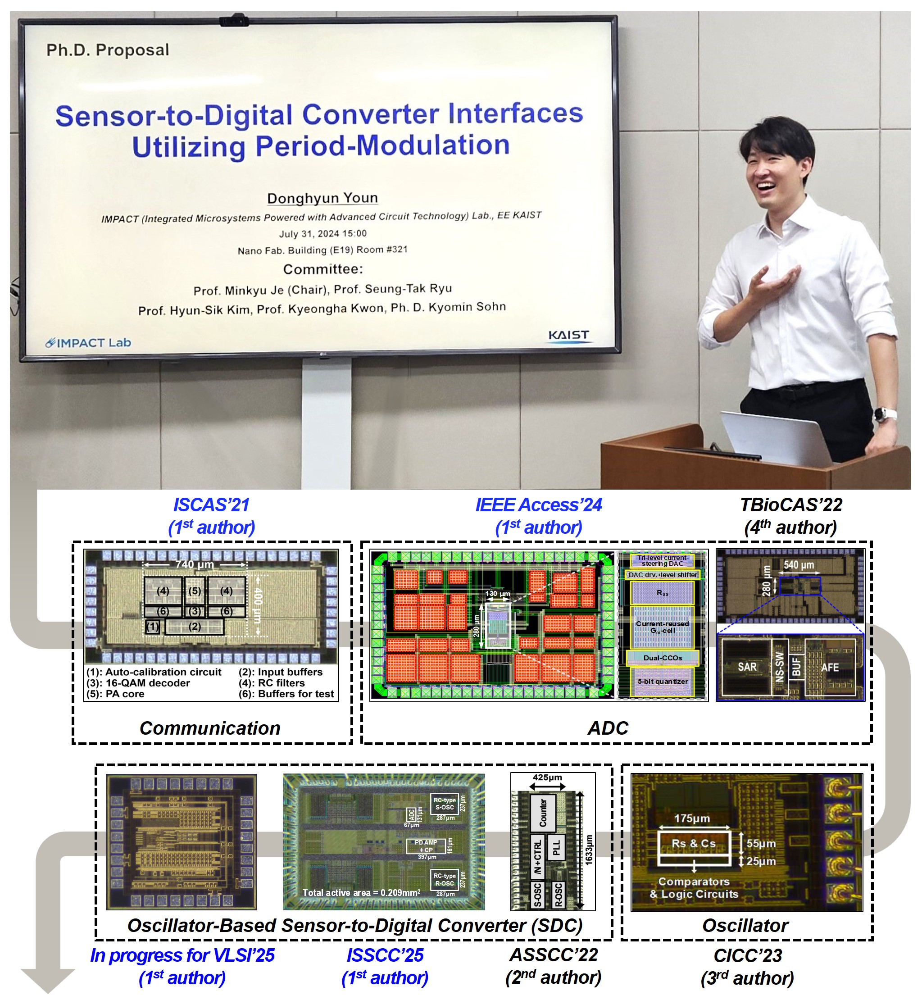

## I'm Donghyun Youn, a Ph.D. student from KAIST

  

  

I am an IC designer, as a member of [IMPACT Lab](https://impact.kaist.ac.kr/) with 35+ graduate students and 14+ research projects. 
I have enjoyed discussions with them to experience broad range of applications and circuit blocks,  
**being proficient in** 
1) analog/mixed-signal IC designs 
2) mathematical analysis on their behavior or noise model. 

**During my Ph.D. degrees, I led six successful tape-outs**, designing following circuits:
+ Frequency-Locked Loop (FLL) & Oscillators
+ Analog-to-Digital Converter (SAR, ΔΣM)
+ RF Transmitter 

**which are implemented in diverse process nodes**:
+ TSMC 180nm GP
+ Global Foundry 130nm LP
+ TSMC 65nm GP
+ TSMC 55nm ULP
+ Samsung 28nm LPP 

I am on the **lookout for internship opportunities in IC design**, 
and **being on-site at San Francisco in Feb. 2025 to present my paper in ISSCC**.

If you are requiring any assistance or interested in my experience, please **feel free to reach me**. 
I would be happy to tell you the details and dive into discussions. 

I look forward to connecting with you. 
Thank you! 
 

  
  
  &nbsp;

